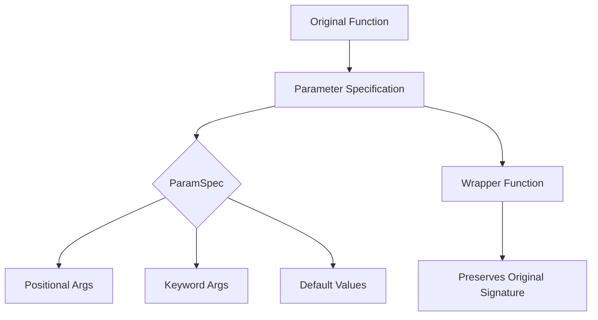

# ParamSpec

ParamSpec is a powerful feature introduced in Python 3.10 for type hinting callable parameters. It's particularly useful when you need to preserve the exact parameter types of a callable.

**1. Core Concept:**
ParamSpec captures the entire parameter specification of a callable, including:
- Positional parameters
- Keyword parameters
- Default values
- *args and **kwargs

Let's visualize how ParamSpec works:

```goat
Function Signature
     ↓
def func(a: int, b: str, *args, **kwargs)
        └─────────┬──────────┘
                  │
            ParamSpec 'P'
            captures all of this
```

**2. Practical Example with Detailed Breakdown:**
```python
from typing import Callable, TypeVar, ParamSpec

# Define our type variables
T = TypeVar('T')  # For return type
P = ParamSpec('P')  # For parameters

def create_logged_function(func: Callable[P, T]) -> Callable[P, T]:
    def wrapper(*args: P.args, **kwargs: P.kwargs) -> T:
        print(f"Calling {func.__name__} with args={args}, kwargs={kwargs}")
        result = func(*args, **kwargs)
        print(f"Result: {result}")
        return result
    return wrapper

# Example usage
@create_logged_function
def add(x: int, y: int, *, multiply: bool = False) -> int:
    return x * y if multiply else x + y
```

Let's create a visual representation of how ParamSpec preserves the function signature:



**3. Why ParamSpec is Important:**

Without ParamSpec:
```python
# ❌ Less precise without ParamSpec
def bad_decorator(func: Callable[..., T]) -> Callable[..., T]:
    def wrapper(*args, **kwargs) -> T:  # Lost type information
        return func(*args, **kwargs)
    return wrapper

# ✅ Better with ParamSpec
def good_decorator(func: Callable[P, T]) -> Callable[P, T]:
    def wrapper(*args: P.args, **kwargs: P.kwargs) -> T:  # Preserves types
        return func(*args, **kwargs)
    return wrapper
```

**4. Advanced Usage Examples:**

```python
from typing import Callable, TypeVar, ParamSpec

T = TypeVar('T')
P = ParamSpec('P')

# Example 1: Function validator
def validate_output(predicate: Callable[[T], bool]) -> Callable[[Callable[P, T]], Callable[P, T]]:
    def decorator(func: Callable[P, T]) -> Callable[P, T]:
        def wrapper(*args: P.args, **kwargs: P.kwargs) -> T:
            result = func(*args, **kwargs)
            if not predicate(result):
                raise ValueError(f"Invalid result: {result}")
            return result
        return wrapper
    return decorator

# Example 2: Retry decorator
def retry(attempts: int) -> Callable[[Callable[P, T]], Callable[P, T]]:
    def decorator(func: Callable[P, T]) -> Callable[P, T]:
        def wrapper(*args: P.args, **kwargs: P.kwargs) -> T:
            for i in range(attempts):
                try:
                    return func(*args, **kwargs)
                except Exception as e:
                    if i == attempts - 1:
                        raise
            raise RuntimeError("Should not reach here")
        return wrapper
    return decorator
```

**5. Common Use Cases:**

1. **Function Decorators:**
```python
from typing import Callable, TypeVar, ParamSpec

T = TypeVar('T')
P = ParamSpec('P')

def timing_decorator(func: Callable[P, T]) -> Callable[P, T]:
    def wrapper(*args: P.args, **kwargs: P.kwargs) -> T:
        import time
        start = time.time()
        result = func(*args, **kwargs)
        end = time.time()
        print(f"Function {func.__name__} took {end - start:.2f} seconds")
        return result
    return wrapper
```

2. **Function Factories:**
```python
def create_cached_function(func: Callable[P, T]) -> Callable[P, T]:
    cache = {}
    def wrapper(*args: P.args, **kwargs: P.kwargs) -> T:
        key = (args, frozenset(kwargs.items()))
        if key not in cache:
            cache[key] = func(*args, **kwargs)
        return cache[key]
    return wrapper
```

**6. Key Benefits:**

1. **Type Safety:** Maintains complete type information throughout the call chain
2. **IDE Support:** Better autocomplete and error detection
3. **Documentation:** Self-documenting code with precise type specifications
4. **Flexibility:** Works with any callable signature
