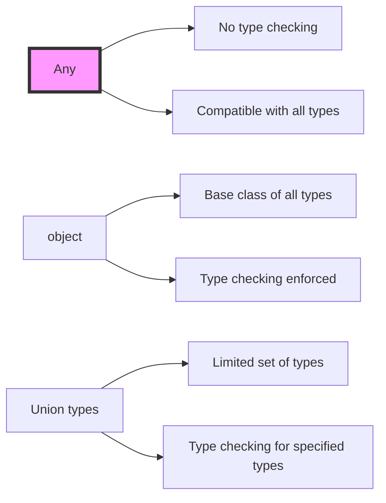

# any
**Core Concept:**
The `Any` type is part of Python's typing system and represents a type that can be literally anything. It's imported from the `typing` module and is essentially an escape hatch in the type system.

```python
from typing import Any
```

Let's break this down with detailed examples and use cases:

**1. Basic Usage**

```python
from typing import Any

# Variable can hold any type
x: Any = 1        # Valid
x = "hello"       # Valid
x = [1, 2, 3]     # Valid
x = None          # Valid

# Function accepting and returning any type
def process_data(data: Any) -> Any:
    return data
```

**2. Key Characteristics**

Here's a visual representation of how `Any` relates to other types:

```goat
                    Any
                     |
         +-----------+-----------+
         |           |           |
      Numbers     Strings     Objects
         |           |           |
    (int, float)   str     (custom classes)
```

**3. Common Use Cases**

Let's explore when to use `Any` with concrete examples:

```python
from typing import Any, List, Dict

# 1. Mixed-type collections
mixed_list: List[Any] = [1, "hello", True, 3.14]

# 2. Unknown external data
def parse_json_response(response: Any) -> Dict[str, Any]:
    return response.json()

# 3. Dynamic attribute access
class DynamicClass:
    def __getattr__(self, name: str) -> Any:
        return self.__dict__.get(name)
```

**4. Comparison with Other Types**

Let's see how `Any` differs from similar concepts:



**5. Best Practices and Warnings**

```python
from typing import Any, List, Optional

# ❌ Avoid excessive use of Any
def bad_practice(data: Any) -> Any:
    return data.something()  # No type checking!

# ✅ Better: Use more specific types when possible
def good_practice(data: Optional[Dict[str, str]]) -> List[str]:
    if data is None:
        return []
    return list(data.values())
```

**6. Advanced Usage Patterns**

```python
from typing import Any, TypeVar, Generic

T = TypeVar('T')

# Using Any in generic classes
class Container(Generic[T]):
    def __init__(self, item: T) -> None:
        self.item = item

    def get_item(self) -> T:
        return self.item

# Any vs explicit type variable
container_any: Container[Any] = Container(42)
container_int: Container[int] = Container(42)
```

**7. Common Gotchas**

```python
from typing import Any, List

# Gotcha 1: Any vs Object
def process_list(items: List[Any]) -> None:  # Accepts list of anything
    for item in items:
        print(item)

def process_objects(items: List[object]) -> None:  # Technically more restrictive
    for item in items:
        print(item)

# Gotcha 2: Type inference with Any
x: Any = 1
reveal_type(x)  # Type is Any, not int

y = 1  # Better: Let Python infer the type
reveal_type(y)  # Type is int
```

**8. When to Use Any**

✅ Good use cases:
- Working with dynamic data (JSON, YAML)
- Interfacing with external APIs
- Implementing dynamic behaviors
- Migration of legacy code

❌ Avoid using Any when:
- You know the specific type
- Type checking is crucial for correctness
- Working with core business logic
- Building public APIs

**Real-world Example:**

```python
from typing import Any, Dict, TypeVar, Type

T = TypeVar('T')

class DataParser:
    def parse_unknown_data(self, data: Any) -> Dict[str, Any]:
        """Parse data of unknown structure."""
        if isinstance(data, dict):
            return data
        elif isinstance(data, str):
            return {"value": data}
        return {"data": str(data)}

    def parse_known_data(self, data: Any, target_type: Type[T]) -> T:
        """Parse data into a known type."""
        if isinstance(data, target_type):
            return data
        raise TypeError(f"Cannot convert {type(data)} to {target_type}")
```

**Key Takeaways:**

1. `Any` is a special type hint that represents complete type flexibility
2. Use it sparingly and only when more specific types aren't practical
3. It's useful for gradual typing and working with dynamic data
4. Consider it a last resort in type hinting
5. Always prefer more specific types when possible

