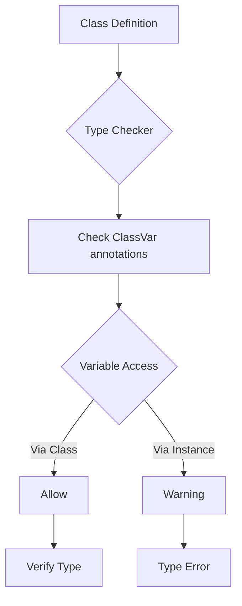

# ClassVar

**1. What is ClassVar?**

`ClassVar` is a special type annotation that explicitly marks class variables in Python. It was introduced in Python 3.5.3 (via PEP 526) to distinguish between class and instance variables during static type checking.

Let's visualize how `ClassVar` works in memory:

```goat
                 Class Definition
                 +------------------+
ClassVar[int] -->| counter = 0      |
                 |------------------|
str ------------>| name             |
                 | age: int         |
                 +------------------+
                         |
         +---------------+---------------+
         |                              |
   Instance 1                    Instance 2
   +------------------+          +------------------+
   | name = "John"    |          | name = "Jane"    |
   | age = 30         |          | age = 25         |
   +------------------+          +------------------+
   counter (shared) -------------------------^
```

**2. Basic Usage**

```python
from typing import ClassVar

class Student:
    # Class variable
    total_students: ClassVar[int] = 0
    
    # Instance variables
    name: str
    age: int
    
    def __init__(self, name: str, age: int):
        self.name = name
        self.age = age
        Student.total_students += 1
```

**3. Type Checking Flow**

Let's create a diagram showing how type checkers handle ClassVar:



**4. Common Use Cases**

1. **Counters and Statistics:**
```python
class Transaction:
    total_transactions: ClassVar[int] = 0
    total_amount: ClassVar[float] = 0.0
    
    def __init__(self, amount: float):
        self.amount = amount
        Transaction.total_transactions += 1
        Transaction.total_amount += amount
```

2. **Configuration and Constants:**
```python
class DatabaseConfig:
    DEFAULT_PORT: ClassVar[int] = 5432
    DEFAULT_HOST: ClassVar[str] = "localhost"
    TIMEOUT: ClassVar[int] = 30
    
    def __init__(self, host: str = None):
        self.host = host or self.DEFAULT_HOST
```

3. **Cache and Shared Resources:**
```python
from typing import ClassVar, Dict, Optional

class Cache:
    _cache: ClassVar[Dict[str, str]] = {}
    
    @classmethod
    def get(cls, key: str) -> Optional[str]:
        return cls._cache.get(key)
    
    @classmethod
    def set(cls, key: str, value: str) -> None:
        cls._cache[key] = value
```

**5. Common Patterns and Best Practices**

1. **Type Variations:**
```python
class Examples:
    # Basic types
    count: ClassVar[int] = 0
    name: ClassVar[str] = "Default"
    
    # Container types
    valid_states: ClassVar[list[str]] = ["PENDING", "ACTIVE", "CLOSED"]
    config: ClassVar[dict[str, str]] = {"env": "prod"}
    
    # Optional types
    cache: ClassVar[Optional[dict]] = None
```

2. **Class Methods and ClassVar:**
```python
class Registry:
    _registry: ClassVar[dict] = {}
    
    @classmethod
    def register(cls, name: str, value: any) -> None:
        cls._registry[name] = value
    
    @classmethod
    def get(cls, name: str) -> any:
        return cls._registry.get(name)
```

**6. What Not to Do with ClassVar**

```python
class BadExample:
    # DON'T: Instance-specific data as ClassVar
    user_data: ClassVar[dict] = {}  # This will be shared!
    
    # DON'T: Mutable default values as ClassVar
    items: ClassVar[list] = []  # Shared list - dangerous!
    
    # DON'T: Try to reassign through instance
    def wrong_update(self):
        self.user_data = {}  # Type checker will warn
```

**7. Common Mistakes and Solutions**

1. **Mistake: Modifying ClassVar through instance**
```python
class Wrong:
    counter: ClassVar[int] = 0
    
    def increment(self):
        self.counter += 1  # WRONG: Type checker will complain

class Right:
    counter: ClassVar[int] = 0
    
    def increment(self):
        Right.counter += 1  # Correct: Access through class
```

2. **Mistake: Using ClassVar for instance-specific data**
```python
class Wrong:
    items: ClassVar[list] = []  # WRONG: Shared between instances
    
class Right:
    _all_items: ClassVar[list] = []  # Class-level tracking
    
    def __init__(self):
        self.items: list = []  # Instance-specific list
```

**Key Insights:**

1. `ClassVar` helps type checkers distinguish between class and instance variables
2. Use it for data that should be shared across all instances
3. Always access `ClassVar` through the class, not instances
4. Perfect for counters, registries, and shared resources
5. Be careful with mutable `ClassVar` values

