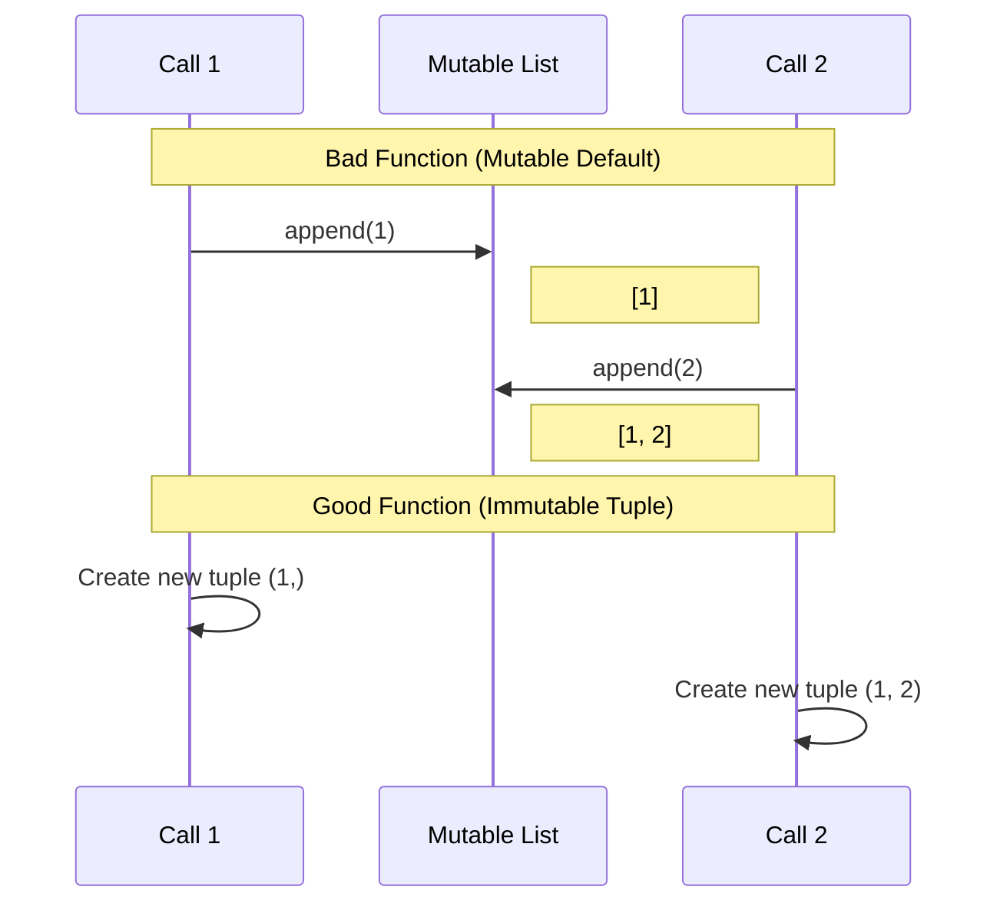
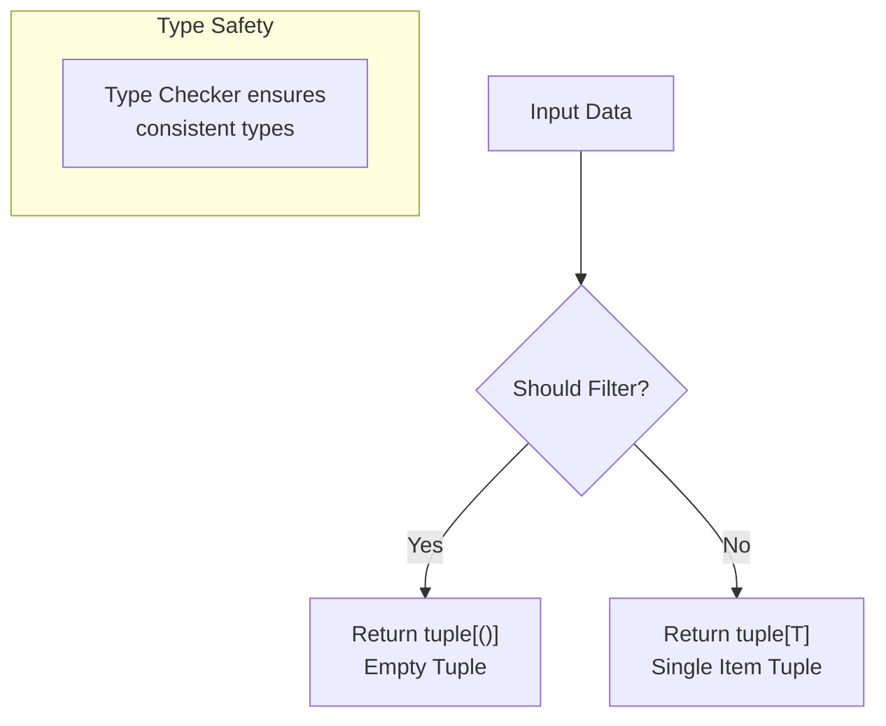
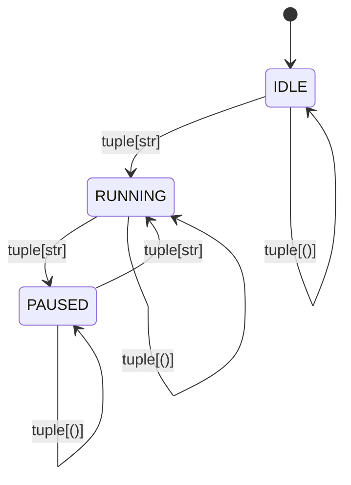

# empty tuple

Let's explore the type annotation `tuple[()]` in Python and how it specifically represents an empty tuple.

**1. Understanding Type Annotations for Tuples**

In Python's type system, tuple types are represented in two main ways:

```python
# General tuple with specific types
tuple[int, str]  # A tuple containing an int followed by a str
tuple[int, ...]  # A variable-length tuple of integers

# Empty tuple
tuple[()]  # A tuple with exactly zero elements
```

**2. Breaking Down `tuple[()]`**

Let's understand why this syntax works:

```goat
                tuple[()]
                    |
         +----------+----------+
         |                     |
    tuple (type)           () (empty)
         |                     |
   Generic Type         Empty Tuple Value
```

The reason `tuple[()]` works is because:
- `()` is the literal syntax for an empty tuple
- When used inside `tuple[...]`, it specifies that we want a tuple type with exactly zero elements

**3. Practical Example**

```python
def accepts_empty_tuple(x: tuple[()]) -> None:
    assert len(x) == 0, "Must be empty tuple"

# Valid usage
accepts_empty_tuple(())

# Invalid usage - will fail type checking
accepts_empty_tuple((1,))        # Wrong: Has elements
accepts_empty_tuple(tuple())     # OK: Runtime empty tuple
accepts_empty_tuple([])          # Wrong: List, not tuple
```

**4. Alternative Representations**

It's worth noting there are other ways to work with empty tuples:

```python
# These are equivalent at runtime
empty_tuple1: tuple[()]    # Most explicit
empty_tuple2: Tuple[()]    # Using capital Tuple (older style)
empty_tuple3 = ()         # Direct assignment
empty_tuple4 = tuple()    # Constructor
```

**5. Type Hierarchy Visualization**

Here's how empty tuple type fits in the type hierarchy:

```goat
          Sequence
             |
           Tuple
        /    |    \
  Tuple[T]   |   Tuple[()]
             |
        tuple[Any]
```

**6. Key Insights**

1. **Specificity**: `tuple[()]` is more specific than just `tuple`. It tells both humans and type checkers that the tuple must be empty.

2. **Type Safety**: This annotation helps catch errors at type-checking time rather than runtime:

```python
def process_empty_tuple(t: tuple[()]) -> None:
    pass

# Type checker will catch these errors:
process_empty_tuple((1,))    # Error: Expected empty tuple
process_empty_tuple([])      # Error: Expected tuple, got list
```

3. **Runtime Behavior**: At runtime, all empty tuples are the same:
```python
# All these are True
() == tuple()
len(()) == 0
isinstance((), tuple)
```

**7. Common Use Cases**

Empty tuples are often used in these scenarios:
- Sentinel values
- Default arguments
- Return values from functions that complete successfully but have no data to return
- Type constraints in generic programming

This type annotation is particularly useful when you want to be explicit about requiring an empty tuple, rather than just any tuple or any empty sequence.

# Common Scenarios
I'll elaborate on the common scenarios where empty tuples and the `tuple[()]` type annotation are particularly useful.

**1. Sentinel Values**

Sentinel values are special values used to signify specific conditions. Empty tuples make great sentinels because they're immutable and singleton (all empty tuples are the same object in Python).

```python
from typing import Union, Optional

class Cache:
    SENTINEL = tuple()  # Using empty tuple as sentinel

    def __init__(self):
        self._cache: dict[str, Union[str, tuple[()]]] = {}

    def get(self, key: str) -> Optional[str]:
        # Using sentinel to distinguish between cached None
        # and missing values
        value = self._cache.get(key, self.SENTINEL)
        if value is self.SENTINEL:
            return None
        return value
```

**2. Default Arguments**

Empty tuples are excellent default arguments because they're immutable, preventing the common mutable default argument pitfall:

```python
# BAD: Mutable default argument
def bad_append(item: int, items: list = []) -> list:
    items.append(item)
    return items

# GOOD: Using empty tuple as default
def good_append(item: int, items: tuple[()] | tuple[int, ...] = ()) -> tuple[int, ...]:
    return tuple(list(items) + [item])

# Usage
result1 = good_append(1)          # (1,)
result2 = good_append(2, (1,))    # (1, 2)
```

Let's visualize the difference in behavior:



**3. Return Values for "No Data" Operations**

Empty tuples are perfect for operations that succeed but have no meaningful data to return:

```python
from typing import Union, Literal
from dataclasses import dataclass

@dataclass
class DatabaseConnection:
    host: str
    port: int

class DatabaseOperations:
    def execute_query(self, query: str) -> Union[tuple[()], tuple[str, ...]]:
        if query.strip().upper().startswith("SELECT"):
            return ("result1", "result2")  # Return data for SELECT
        else:
            return ()  # No data for INSERT/UPDATE/DELETE

    def connect(self) -> tuple[()] | Literal[False]:
        try:
            # Attempt connection
            return ()  # Success, no data to return
        except Exception:
            return False  # Connection failed
```

**4. Type Constraints in Generic Programming**

Empty tuples are useful in generic programming when you need to constrain type parameters:

```python
from typing import TypeVar, Generic

T = TypeVar('T')

class ProcessingPipeline(Generic[T]):
    def __init__(self, initial_data: T):
        self.data = initial_data

    def process(self) -> tuple[()] | tuple[T]:
        if self._should_filter_out():
            return ()  # Nothing to return
        return (self.data,)  # Return processed data

# Usage with type checking
pipeline_int = ProcessingPipeline[int](42)
result_int: tuple[()] | tuple[int] = pipeline_int.process()

pipeline_str = ProcessingPipeline[str]("hello")
result_str: tuple[()] | tuple[str] = pipeline_str.process()
```

Let's visualize the processing pipeline:



**5. State Machine Transitions**

Empty tuples can represent "no-op" transitions in state machines:

```python
from enum import Enum, auto
from typing import TypeVar, Union

class State(Enum):
    IDLE = auto()
    RUNNING = auto()
    PAUSED = auto()

T = TypeVar('T')

class StateMachine:
    def __init__(self):
        self.state = State.IDLE

    def transition(self,
                  new_state: State
                  ) -> Union[tuple[()], tuple[str]]:
        if new_state == self.state:
            return ()  # No transition needed

        if self._is_valid_transition(new_state):
            old_state = self.state
            self.state = new_state
            return (f"Transitioned from {old_state} to {new_state}",)
        return ()  # Invalid transition
```

Here's a visualization of the state machine:



These scenarios showcase how empty tuples and `tuple[()]` provide type-safe, immutable, and semantically meaningful ways to handle various programming patterns. The type annotation helps catch errors at compile-time and makes the code's intentions clearer.
