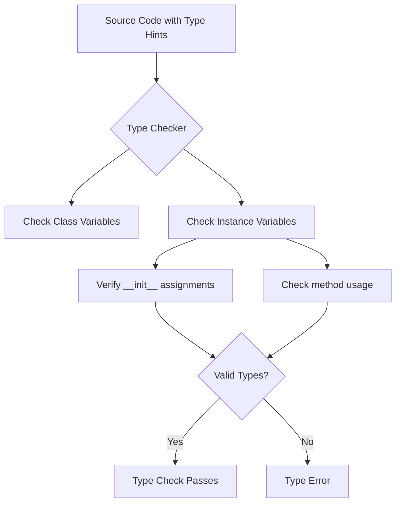

# instance var

Let's start with an in-depth look at instance variables and their typing in Python.

**1. Basic Instance Variable Type Hints**

The primary way to type instance variables in Python is to declare them in the class body with annotations. Unlike `ClassVar`, instance variables don't need a special type - you just declare them directly:

```python
from typing import Optional

class Person:
    # Instance variables with type hints
    name: str  # Required string instance variable
    age: int  # Required integer instance variable
    email: Optional[str] = None  # Optional instance variable with default
```

**2. Understanding Instance vs Class Variables**

Let's visualize the difference between instance and class variables:

```goat
                   Person Class
                   +-----------------+
ClassVar[int] -->  |  total_count    |
                   |-----------------| 
                   |     name: str   | <-- Instance var
                   |     age: int    | <-- Instance var
                   |  email: str     | <-- Instance var
                   +-----------------+
                          ▲
                          |
                   +-----------------+
Instance 1         |   name: "John"  |
                   |   age: 30       |
                   |   email: "j@..."| 
                   +-----------------+
                          ▲
                          |
                   +-----------------+
Instance 2         |   name: "Jane"  |
                   |   age: 25       |
                   |   email: "e@..."| 
                   +-----------------+
```

**3. Type Checkers and PEP 526**

Let's look at how type checkers interpret instance variables. I'll create a mermaid diagram to show the flow:



**4. Advanced Instance Variable Patterns**

Here are some advanced patterns for typing instance variables:

```python
from typing import TypeVar, Generic, Optional, Union

T = TypeVar('T')

class Container(Generic[T]):
    # Generic instance variable
    value: T
    
    # Union type instance variable
    id: Union[int, str]
    
    # Optional with default
    metadata: Optional[dict] = None
    
    def __init__(self, value: T, id: Union[int, str]):
        self.value = value
        self.id = id
```

**5. Instance Variables vs `ClassVar`**

Here's a complete example showing both:

```python
from typing import ClassVar, Optional

class Student:
    # Class variable (shared across all instances)
    total_students: ClassVar[int] = 0
    
    # Instance variables (unique to each instance)
    name: str
    grade: float
    student_id: int
    notes: Optional[str] = None
    
    def __init__(self, name: str, grade: float, student_id: int):
        self.name = name
        self.grade = grade
        self.student_id = student_id
        Student.total_students += 1
```

**6. Best Practices and Common Patterns**

1. **Default Values:**
```python
class Configuration:
    # Instance variables with defaults
    host: str = "localhost"
    port: int = 8080
    debug: bool = False
```

2. **Property Decorators:**
```python
class Circle:
    radius: float
    
    @property
    def area(self) -> float:
        return 3.14159 * self.radius ** 2
```

3. **Private Variables:**
```python
class Account:
    _balance: float  # Protected
    __secret: str    # Private
```

**7. Common Gotchas and Solutions**

1. **Initialization Order:**
```python
class Wrong:
    # Type checker might complain
    x: int
    
class Right:
    x: int
    
    def __init__(self):
        self.x = 0  # Always initialize in __init__
```

2. **Mutable Defaults:**
```python
class Better:
    items: list[str] = []  # WRONG: shared mutable state
    
    def __init__(self):
        self.items: list[str] = []  # RIGHT: instance-specific list
```

**High-Level Insights:**

1. Unlike `ClassVar`, regular instance variables don't need a special type constructor - they're the default.
2. Type hints for instance variables serve two purposes:
   - Documentation for developers
   - Static type checking
3. Instance variables should generally be initialized in `__init__`
4. The type system is gradual - you can mix typed and untyped code
