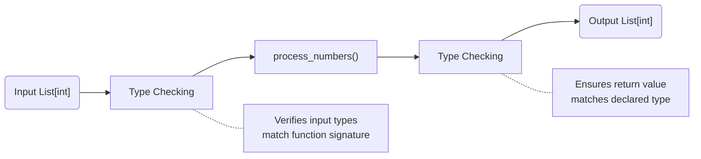

# list

**Basic List Type Hints**

The fundamental way to declare a list type hint in Python uses the `list` type with square brackets to specify the type of elements:

```python
# Basic list of integers
numbers: list[int] = [1, 2, 3, 4, 5]

# Basic list of strings
names: list[str] = ["Alice", "Bob", "Charlie"]
```

**Type Hint Evolution**

Let me show you how list type hints have evolved:

```python
# Python 3.5+ (deprecated)
from typing import List
numbers: List[int] = [1, 2, 3]

# Python 3.9+ (modern approach)
numbers: list[int] = [1, 2, 3]  # Built-in list type
```

**Complex List Types**

Lists can contain more complex types. Let's explore different scenarios:

```python
# Nested lists
matrix: list[list[int]] = [[1, 2], [3, 4]]

# List of optional values
from typing import Optional
nullable_numbers: list[Optional[int]] = [1, None, 3, None, 5]

# List of mixed types using Union
from typing import Union
mixed_list: list[Union[int, str]] = [1, "two", 3, "four"]

# List of any type
from typing import Any
flexible_list: list[Any] = [1, "two", True, 3.14]
```

Let's visualize how these type hints work in memory:

```goat
                List[int]
                    |
     .───────────────────────────.
     │                           │
    [1]    [2]    [3]    [4]    [5]
     │      │      │      │      │
     int    int    int    int    int

           List[List[int]]
                 |
        .───────────────.
        │               │
    [1, 2]          [3, 4]
     │  │            │  │
    int int         int int
```

**Function Signatures with List Types**

Here's how to use list type hints in functions:

```python
def process_numbers(numbers: list[int]) -> list[int]:
    """Process a list of integers and return a new list."""
    return [num * 2 for num in numbers]

def append_to_list(items: list[str], item: str) -> None:
    """Append an item to a list (modifies in place)."""
    items.append(item)
```

Let's visualize the function flow:



**Advanced Concepts**

1. **Covariance and Contravariance**
```python
# Covariant type variable
from typing import TypeVar

T_co = TypeVar('T_co', covariant=True)

class ReadOnlyList(Generic[T_co]):
    def __init__(self, items: list[T_co]) -> None:
        self._items = items
```

2. **Protocol Support**
```python
from typing import Protocol

class Sizeable(Protocol):
    def size(self) -> int: ...

def process_sized_items(items: list[Sizeable]) -> int:
    return sum(item.size() for item in items)
```

**Best Practices and Common Pitfalls**

1. **Do's:**
   - Always specify the type of elements in the list
   - Use the built-in `list` type for Python 3.9+
   - Consider using more specific types when possible

2. **Don'ts:**
   - Don't use `List` from typing module in newer Python versions
   - Avoid using `list[Any]` unless absolutely necessary
   - Don't confuse runtime type checking with static type hints

**Type Checking in Action**

Here's how a type checker like mypy would analyze your code:

```python
# mypy will approve this
numbers: list[int] = [1, 2, 3]
numbers.append(4)  # OK

# mypy will flag this as an error
numbers.append("5")  # Error: Argument 1 to "append" of "list" has incompatible type "str"; expected "int"
```

**Advanced Real-World Example**

Here's a more complex example showing how list type hints work in a practical scenario:

```python
from typing import TypeVar, Callable

T = TypeVar('T')
U = TypeVar('U')

def transform_list(items: list[T], transformer: Callable[[T], U]) -> list[U]:
    """
    Transform a list of items of type T into a list of type U
    using the provided transformer function.
    """
    return [transformer(item) for item in items]

# Usage
numbers: list[int] = [1, 2, 3]
strings: list[str] = transform_list(numbers, str)
```
