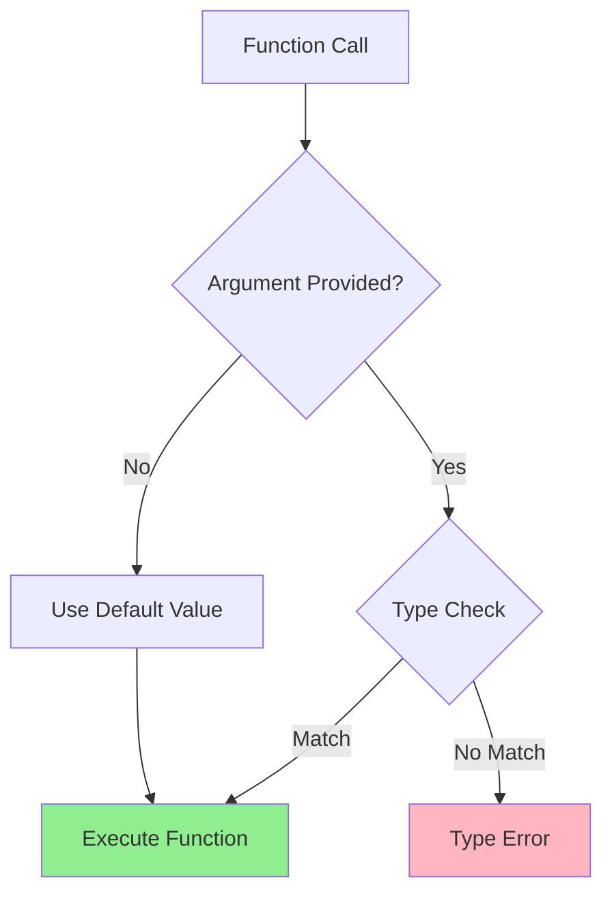

# optional

**1. Using the Optional Type**

The most common way to express optional types is using `Optional` from the `typing` module. Here's a comprehensive explanation:

```python
from typing import Optional

def greet(name: Optional[str] = None) -> str:
    if name is None:
        return "Hello, Guest!"
    return f"Hello, {name}!"
```

**2. Union with None**

Another equivalent approach is using `Union` with `None`:

```python
from typing import Union

def process_data(data: Union[list, None] = None) -> list:
    if data is None:
        return []
    return data
```

Let me create a visual representation to show how these type hints work in the context of function calls:



**3. Different Ways to Express Optional Types**

Here are the main approaches with their specific use cases:

```python
from typing import Optional, Union, Any

# Method 1: Using Optional
def func1(arg: Optional[int] = None) -> int:
    return arg if arg is not None else 0

# Method 2: Using Union with None
def func2(arg: Union[str, None] = None) -> str:
    return arg if arg is not None else ""

# Method 3: Using default values with type
def func3(arg: int = 0) -> int:
    return arg

# Method 4: Using Any for maximum flexibility
def func4(arg: Any = None) -> Any:
    return arg if arg is not None else None
```

**4. Key Insights and Best Practices**

1. **`Optional` vs `Union`**
   - `Optional[T]` is equivalent to `Union[T, None]`
   - `Optional` is more readable and explicitly indicates optionality

2. **Default Values**
   ```python
   # Good: Type matches default value
   def process_list(items: Optional[list] = None) -> list:
       return items or []

   # Better: More specific about contained type
   def process_numbers(items: Optional[list[int]] = None) -> list[int]:
       return items or []
   ```

3. **Type Checking Behavior**
   ```python
   from typing import Optional
   
   # This allows both None and int
   def func(x: Optional[int]) -> str:
       return str(x if x is not None else 0)
   
   # These are all valid
   func(None)    # Valid
   func(42)      # Valid
   func()        # Error: missing required argument
   ```

**5. Common Patterns and Use Cases**

```python
from typing import Optional, TypeVar

T = TypeVar('T')

# Generic optional parameter
def get_or_default(value: Optional[T], default: T) -> T:
    return value if value is not None else default

# Multiple optional parameters
def configure(host: Optional[str] = None, 
             port: Optional[int] = None,
             timeout: Optional[float] = None) -> dict:
    config = {}
    if host is not None:
        config['host'] = host
    if port is not None:
        config['port'] = port
    if timeout is not None:
        config['timeout'] = timeout
    return config
```

**6. Type Checking and IDE Support**

Modern IDEs like PyCharm or VSCode with Pylance will provide:
- Warning for incorrect types
- Autocompletion support
- Documentation hints

**Best Practices Summary:**

1. Use `Optional` when a parameter can be `None`
2. Match default values with their type annotations
3. Be explicit about container types (e.g., `list[int]` instead of just `list`)
4. Use `TypeVar` for generic type annotations
5. Consider using more specific types instead of `Any` when possible

