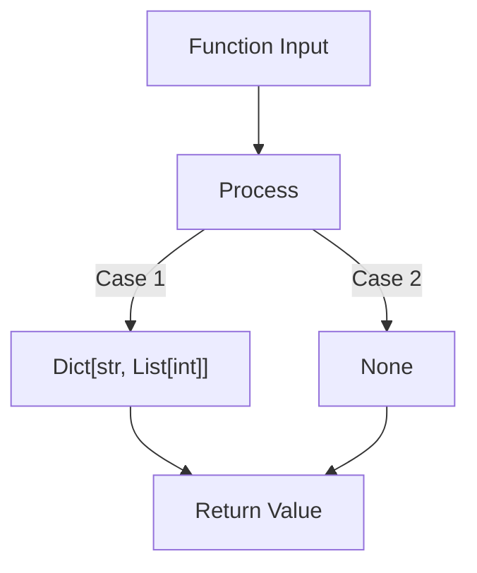

# return

**Basic Return Type Hints**

Let's start with the fundamental syntax and gradually move to more complex scenarios.

```python
def get_name() -> str:
    return "Alice"

def calculate_age(birth_year: int) -> int:
    return 2024 - birth_year
```

**Visual Representation of Type Hint Flow**

```goat
                           +----------------+
 Input Parameters          |    Function    |         Return Type
        →                  |                |            →
  (birth_year: int)        |  calculate_age |        -> int
                           |                |
                           +----------------+
```

Let's explore different return type scenarios:

**1. Basic Types**
```python
# Simple types
def get_count() -> int:
    return 42

def is_valid() -> bool:
    return True

def get_price() -> float:
    return 19.99
```

**2. Optional Returns**
```python
from typing import Optional

def find_user(id: int) -> Optional[str]:
    if id > 0:
        return "User123"
    return None
```

**3. Multiple Return Types (Union)**
```python
from typing import Union

def process_value(val: int) -> Union[str, int]:
    if val > 100:
        return "Too large"
    return val * 2
```

**4. Collections**
```python
from typing import List, Dict, Set, Tuple

def get_users() -> List[str]:
    return ["Alice", "Bob", "Charlie"]

def get_scores() -> Dict[str, int]:
    return {"Alice": 95, "Bob": 87}

def get_coordinates() -> Tuple[int, int]:
    return (10, 20)
```

**5. Complex Types**

Let's visualize a more complex type hierarchy:



```python
from typing import Dict, List, Optional

def get_user_scores() -> Optional[Dict[str, List[int]]]:
    return {
        "Alice": [95, 87, 91],
        "Bob": [88, 92, 85]
    }
```

**6. Generator Returns**
```python
from typing import Generator, Iterator

def count_up() -> Generator[int, None, None]:
    i = 0
    while True:
        yield i
        i += 1
```

**7. Callable Returns**
```python
from typing import Callable

def get_operation() -> Callable[[int, int], int]:
    def add(x: int, y: int) -> int:
        return x + y
    return add
```

**Best Practices and Tips:**

1. **Type Consistency**
   ```python
   # Good
   def get_value() -> Optional[str]:
       if condition:
           return "value"
       return None

   # Avoid
   def get_value() -> str:
       if condition:
           return "value"
       return None  # Type mismatch!
   ```

2. **Documentation Benefits**
   ```python
   def process_data() -> Dict[str, List[int]]:
       """
       Returns a dictionary mapping usernames to their score history.
       
       Returns:
           Dict[str, List[int]]: User score mapping
       """
       return {"user": [1, 2, 3]}
   ```

3. **Type Checking**
   - Use tools like mypy to validate type hints:
   ```bash
   mypy your_script.py
   ```

**Common Pitfalls:**

1. **Forward References**
   ```python
   class Tree:
       # Use string for self-reference
       # when you need to reference a type before it's defined
       def get_child(self) -> 'Tree':  
           return Tree()
   ```

2. **Dynamic Types**
   ```python
   from typing import Any

   def dynamic_function() -> Any:  # Use when return type is truly dynamic
       return some_dynamic_value
   ```
