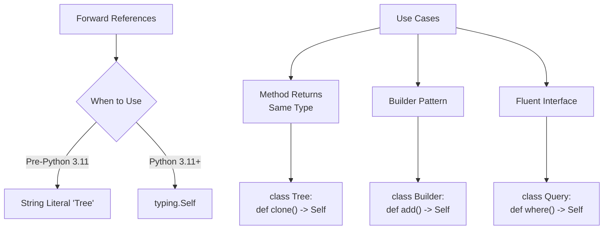
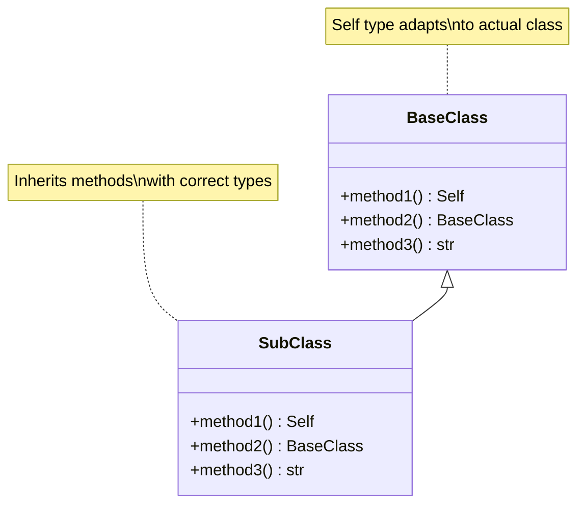

# Self type

Self type in Python was introduced in Python 3.11 to improve type hinting for methods that return instances of their own class.

**1. The Problem Self Type Solves**

Let's first understand why we need `Self` type with a visual representation:

```goat
Before Self Type:
    Builder
    +----------------+
    | build()        |--┐
    +----------------+  |
            ▲           |
            |           |
            └-----------┘
    Returns "Builder" (awkward)

With Self Type:
    Builder
    +----------------+
    | build()        |--┐
    +----------------+  |
            ▲           |
            |           |
            └-----------┘
    Returns "Self" (precise)
```

Old Style (before Python 3.11)
```python
class Tree:
    def get_child(self) -> 'Tree':  # String literal forward reference
        return Tree()
```

Modern Style (Python 3.11+)
```python
from typing import Self  # Available in Python 3.11+

class Tree:
    def get_child(self) -> Self:  # Better! More explicit and type-safe
        return Tree()
```

Let's visualize the differences and use cases:



**2. Basic Usage**

```python
from typing import Self

class Builder:
    def __init__(self) -> None:
        self.result = []

    def add_item(self, item: str) -> Self:  # Returns Self instead of 'Builder'
        self.result.append(item)
        return self  # Method chaining

    def build(self) -> list[str]:
        return self.result

# Usage
builder = Builder().add_item("a").add_item("b").build()
```

**3. Self Type vs Other Return Types**

Let's create a diagram showing different method return types:



**4. Advanced Use Cases**

1. **Self-Returning Methods:**
```python
from typing import Self

class TreeNode:
    def __init__(self, value: int) -> None:
        self.value = value
        self.left: TreeNode | None = None
        self.right: TreeNode | None = None

    def add_left(self, value: int) -> Self:
        self.left = TreeNode(value)
        return self  # Returns self for method chaining

    def clone(self) -> Self:
        new_node = TreeNode(self.value)
        if self.left:
            new_node.left = self.left.clone()
        if self.right:
            new_node.right = self.right.clone()
        return new_node
```

2. **Builder Pattern:**
```python
class QueryBuilder:
    def __init__(self) -> None:
        self.query_parts: list[str] = []

    def select(self, fields: str) -> Self:
        self.query_parts.append(f"SELECT {fields}")
        return self

    def where(self, condition: str) -> Self:
        self.query_parts.append(f"WHERE {condition}")
        return self

    def build(self) -> str:
        return " ".join(self.query_parts)
```

**5. Self Type with Inheritance**

```python
class Animal:
    def clone(self) -> Self:
        return type(self)()

class Dog(Animal):
    def bark(self) -> None:
        print("Woof!")

# The return type is correctly inferred
dog = Dog()
cloned_dog = dog.clone()  # Type is Dog, not Animal
```

**6. When to Use Each Approach:**

```python
# 1. Use Self when the method returns the same type
class Counter:
    def __init__(self, start: int = 0) -> None:
        self.count = start

    def increment(self) -> Self:  # ✅ Perfect use case for Self
        self.count += 1
        return self

# 2. Use string literal when you need to reference a type before it's defined
class CircularRef:
    def get_next(self) -> "CircularRef":  # Still valid when needed
        return CircularRef()

# 3. Use Self for inheritance scenarios
class Animal:
    def reproduce(self) -> Self:  # Works correctly with inherited classes
        return self.__class__()

class Dog(Animal):
    pass  # reproduce() will return Dog, not Animal
```

**7. Important Considerations and Edge Cases**

1. **Mixin Classes:**
```python
from typing import TypeVar, Self

T = TypeVar('T')

class LoggerMixin:
    def with_logging(self) -> Self:  # Works with any class that includes this mixin
        print(f"Logging enabled for {type(self).__name__}")
        return self
```

2. **Abstract Base Classes:**
```python
from abc import ABC, abstractmethod

class Clonable(ABC):
    @abstractmethod
    def clone(self) -> Self:
        pass
```

**8. Key Insights**

1. `Self` is more precise than using the class name as a return type annotation
2. It automatically adapts to inherited classes
3. Perfect for builder patterns and method chaining
4. Helps catch type errors in inheritance hierarchies
5. Works well with alternative constructors and factory methods

**Pitfalls to Avoid:**
```python
class Wrong:
    @classmethod
    def create(cls) -> Self:  # ❌ Error! Self can't be used with @classmethod
        return cls()

    @staticmethod
    def make() -> Self:  # ❌ Error! Self can't be used with @staticmethod
        return Wrong()

class Right:
    @classmethod
    def create(cls) -> "Right":  # ✅ Use string literal here
        return cls()
```

**Which to Choose?**

1. Use Self (Python 3.11+) when:
    - Method returns instance of the same class
    -  Building fluent interfaces
    -  Implementing builder patterns
    -  Working with inheritance

2. Use string literal forward references when:
    - Working with older Python versions
    - Dealing with circular references
    - Using @classmethod or @staticmethod
    - The type isn't available at definition time
