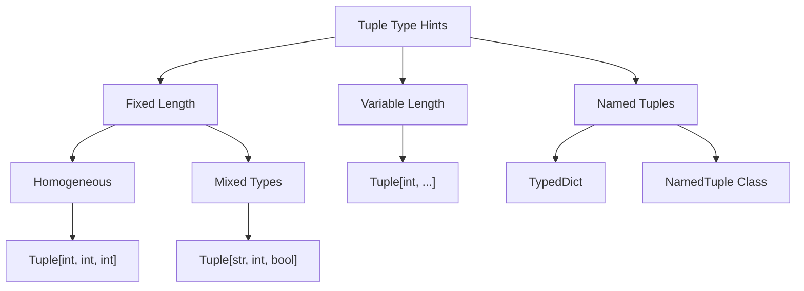

# tuple


Let me create a visual representation to show the key concepts of tuple type hints:



Let's break down tuple type hints in detail:

**1. Basic Tuple Type Hints**

```python
# Fixed-length tuple with specific types
coordinates: tuple[float, float] = (23.5, 45.1)

# Mixed types in a tuple
user_data: tuple[str, int, bool] = ("Alice", 25, True)

# Empty tuple
empty: tuple[()] = ()
```

**2. Homogeneous Tuples (Same Type)**
```python
# Tuple of three integers
triple: tuple[int, int, int] = (1, 2, 3)

# More concise way for homogeneous tuples
# Available in Python 3.9+
scores: tuple[int, ...] = (95, 87, 91, 88)
```

**3. Variable-Length Tuples**
```python
# Variable number of strings
names: tuple[str, ...] = ("Alice", "Bob", "Charlie")

# Variable number of mixed types not possible with ...
# This is NOT valid:
# mixed: tuple[str | int, ...] = ("a", 1, "b", 2)
```

**4. Type Hints with Named Tuples**
```python
from typing import NamedTuple

class Point(NamedTuple):
    x: float
    y: float
    label: str = "unknown"  # With default value

# Usage
point: Point = Point(23.5, 45.1, "center")
```

**5. Common Use Cases and Examples**

```python
from typing import Tuple, NamedTuple

# Function return types
def get_user_stats() -> tuple[str, int, float]:
    return ("Alice", 25, 67.5)

# Tuple as a parameter type
def plot_point(coord: tuple[float, float]) -> None:
    x, y = coord
    # Plot the point...

# Named tuple for better readability
class UserStats(NamedTuple):
    name: str
    age: int
    weight: float

def get_user_stats_named() -> UserStats:
    return UserStats("Alice", 25, 67.5)
```

**6. Key Insights and Best Practices**

1. **Type Safety Benefits:**
   - Catch type-related errors at development time
   - Better IDE support and code completion
   - Clearer code documentation

2. **When to Use Each Pattern:**
   - Use simple tuples for short, obvious groupings
   - Use NamedTuple for complex data structures
   - Use variable-length tuples when dealing with homogeneous collections

3. **Performance Considerations:**
   - Tuples are immutable, making them thread-safe
   - Type hints don't affect runtime performance
   - NamedTuples have minimal overhead compared to regular tuples

**7. Common Pitfalls to Avoid**

```python
# DON'T: Unclear tuple structure
def process_data(data: tuple) -> tuple:  # Too vague!
    return data

# DO: Clear type hints
def process_data(data: tuple[str, int]) -> tuple[str, float]:
    name, age = data
    return (name, float(age) * 1.5)

# DON'T: Using tuple for complex data structures
complex_data: tuple[str, int, str, float, bool] = ("Alice", 25, "NY", 67.5, True)

# DO: Use NamedTuple instead
class UserProfile(NamedTuple):
    name: str
    age: int
    location: str
    weight: float
    active: bool
```
