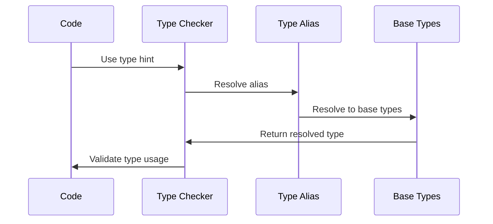

# typealias

Type aliases in Python are a powerful feature for making type hints more readable and maintainable.

**1. Basic Concept**
Type aliases allow you to create custom names for complex types. They're particularly useful when you have:
- Long or complex type definitions
- Frequently reused types
- Types that might change in the future

Let's break this down with progressive examples:

**2. Simple Type Aliases**

```python
from typing import List, Dict

# Instead of writing this everywhere:
def process_numbers(numbers: List[int]) -> List[int]:
    pass

# Create a type alias
Numbers = List[int]

# Now you can write this:
def process_numbers(numbers: Numbers) -> Numbers:
    pass
```

**3. Complex Type Aliases**

```python
from typing import Dict, List, Tuple, Union

# Complex type without alias
def process_data(data: Dict[str, List[Tuple[int, Union[str, float]]]]) -> None:
    pass

# With type alias
ResponseData = Dict[str, List[Tuple[int, Union[str, float]]]]

# Much clearer!
def process_data(data: ResponseData) -> None:
    pass
```

**4. Type Aliases with Generic Types**
Here's how you can create generic type aliases using TypeVar:

```python
from typing import TypeVar, List, Dict

T = TypeVar('T')
Container = List[T]  # Generic container

def first_element(container: Container[T]) -> T:
    return container[0]

# Usage
numbers: Container[int] = [1, 2, 3]
strings: Container[str] = ["a", "b", "c"]
```

**5. Nested Type Aliases**
You can build complex types by combining aliases:

```python
from typing import Dict, List, Union

# Basic aliases
UserId = int
Username = str
Score = float

# Combined aliases
UserData = Dict[UserId, Username]
ScoreData = Dict[UserId, Score]

# Complex alias using others
GameRecord = Dict[UserId, List[Score]]

def update_scores(user: UserId, scores: ScoreData) -> GameRecord:
    pass
```

**6. Type Aliases with New Type**
Sometimes you want to create a distinct type rather than just an alias. Use `NewType`:

```python
from typing import NewType

# Regular type alias
PlayerID = int  # Just an alias, any int will work

# NewType creates a distinct type
PlayerIDNew = NewType('PlayerIDNew', int)

def get_player(id: PlayerIDNew) -> str:
    return f"Player {id}"

# This works with regular alias
regular_id: PlayerID = 123
# This requires explicit conversion with NewType
new_id = PlayerIDNew(123)
```

**7. Modern Python Type Aliases (Python 3.12+)**
In newer Python versions, you can use the `type` keyword:

```python
# Python 3.12+ syntax
type Point = tuple[float, float]
type Points = list[Point]

def calculate_distance(points: Points) -> float:
    pass
```

**8. Best Practices**

Here's a visual representation of how type aliases can improve code organization:

```goat
                                  Without Type Aliases
.───────────────────────────────────────────────────────────────────────.
│                                                                       │
│  Dict[str, List[Tuple[int, str]]]   Dict[str, List[Tuple[int, str]]]  │
│           ↓                               ↓                           │
│    function_1()                     function_2()                      │
│           ↓                               ↓                           │
│  Dict[str, List[Tuple[int, str]]]   Dict[str, List[Tuple[int, str]]]  │
'───────────────────────────────────────────────────────────────────────'

                                  With Type Aliases
.────────────────────────────────────────────────────────────────────────.
│                                                                        │
│                     UserRecord = Dict[str, List[Tuple[int, str]]]      │
│                                     ↓                                  │
│                              UserRecord                                │
│                           ↙            ↘                            │
│                    function_1()    function_2()                        │
'────────────────────────────────────────────────────────────────────────'
```

Let's create a sequence diagram showing how type aliases are resolved during type checking:




**9. Common Use Cases**

1. **API Response Types**
```python
from typing import Dict, List, Optional

JSONValue = Union[str, int, float, bool, None, Dict[str, 'JSONValue'], List['JSONValue']]
APIResponse = Dict[str, JSONValue]
```

2. **Database Models**
```python
from typing import TypedDict

class UserDict(TypedDict):
    id: int
    name: str
    email: str

Users = Dict[int, UserDict]
```

3. **Custom Collections**
```python
from typing import Dict, List

Matrix = List[List[float]]
Graph = Dict[str, List[str]]
```

**10. Debugging Tips**
- Use `reveal_type()` in mypy to check what type is being inferred
- Keep type aliases close to where they're used
- Document complex type aliases with comments
