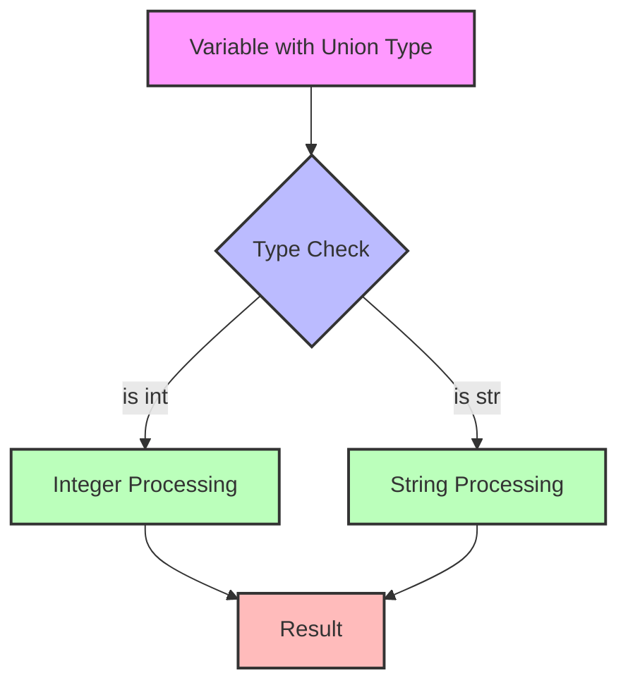

# union

**1. Basic Understanding of Union Types**

Union types (written as `Union[X, Y]` or using the `|` operator in Python 3.10+) allow you to specify that a value could be one of several types. This is particularly useful when a function can accept or return multiple types of values.

**2. Syntax and Evolution**

```python
# Python 3.7+ (using typing module)
from typing import Union

# Traditional syntax
x: Union[int, str] = "hello"

# Python 3.10+ (using | operator)
y: int | str = 42
```

**3. Visual Representation of Union Types**

Let me create a diagram to show how Union types work conceptually:



**4. Practical Examples**

```python
from typing import Union

# Function accepting either int or float
def double_number(value: Union[int, float]) -> Union[int, float]:
    return value * 2

# Function accepting string or list of strings
def process_data(data: Union[str, list[str]]) -> str:
    if isinstance(data, list):
        return ", ".join(data)
    return data.upper()

# Using the functions
print(double_number(10))      # 20
print(double_number(3.14))    # 6.28
print(process_data("hello"))  # HELLO
print(process_data(["a", "b"]))  # a, b
```

**5. Advanced Usage and Patterns**

```python
from typing import Union, Optional, List, Dict

# Optional is a shorthand for Union[X, None]
def greet(name: Optional[str] = None) -> str:
    return f"Hello, {name or 'World'}!"

# Nested Unions
JsonValue = Union[
    str,
    int,
    float,
    bool,
    None,
    List['JsonValue'],
    Dict[str, 'JsonValue']
]

def process_json(data: JsonValue) -> str:
    return str(data)
```

**6. Common Use Cases**

1. **Error Handling**
```python
def divide(a: float, b: float) -> Union[float, str]:
    try:
        return a / b
    except ZeroDivisionError:
        return "Division by zero is not allowed"
```

2. **Optional Parameters**
```python
def create_user(
    name: str,
    age: Optional[int] = None,
    email: Optional[str] = None
) -> dict:
    user = {"name": name}
    if age is not None:
        user["age"] = age
    if email is not None:
        user["email"] = email
    return user
```

**7. Best Practices and Tips**

1. **Type Narrowing**
```python
def process_value(value: Union[int, str]) -> str:
    # Type narrowing using isinstance
    if isinstance(value, int):
        return str(value * 2)  # Type checker knows value is int here
    return value.upper()       # Type checker knows value is str here
```

2. **Using TypeAlias for Complex Unions**
```python
from typing import TypeAlias

# Create a type alias for complex union types
NumberType: TypeAlias = Union[int, float, complex]
StringList: TypeAlias = Union[str, list[str]]
```

**8. Common Pitfalls to Avoid**

1. **Unnecessary Unions**
```python
# Bad: Unnecessary Union
def process_data(value: Union[str, str]) -> str:
    return value.upper()

# Good: Simple type hint
def process_data(value: str) -> str:
    return value.upper()
```

2. **Overuse of Union Types**
```python
# Bad: Too many types can make code hard to maintain
def complex_function(
    data: Union[str, int, float, list, dict, tuple]
) -> Union[str, int, float, list, dict, tuple]:
    return data

# Good: Consider creating a custom type or narrowing the scope
from typing import Any
def complex_function(data: Any) -> Any:
    return data
```

**Key Takeaways**

1. Union types provide flexibility in type hints while maintaining type safety
2. They're particularly useful for functions that can handle multiple types
3. Type narrowing is important when working with Union types
4. Python 3.10+ offers a more concise syntax with the `|` operator
5. Optional is a special case of Union with None
